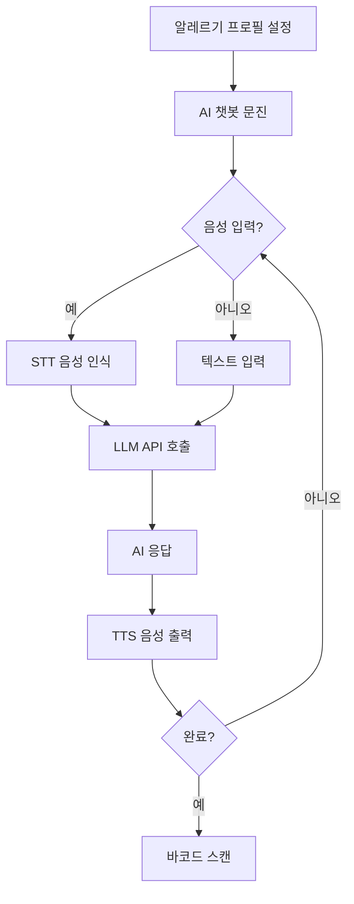

# AI 챗봇 기능 완성 보고서

## 🎉 구현 완료!

**전문가 시스템 기반** 의료 문진 챗봇이 성공적으로 추가되었습니다.

### 🔄 2025-11-15 업데이트: 전문가 시스템으로 전환
- **LLM API 의존성 제거**: 항상 작동하는 안정적인 시스템
- **체계적인 데이터 수집**: 각 알레르겐마다 5단계 문진
- **구조화된 데이터 저장**: 알레르기별 상세 정보 저장
- **LLM은 선택적 기능**: 향후 요약/분석용으로 활용 가능

## 📦 새로 추가된 파일

### 1. 컴포넌트
- [`src/components/AIChatbot.js`](./src/components/AIChatbot.js)
  - LLM API 통합
  - STT/TTS 음성 인터페이스
  - 대화 상태 관리
  - 폴백 시스템

### 2. 스타일
- [`src/styles/AIChatbot.css`](./src/styles/AIChatbot.css)
  - 메시지 말풍선 스타일
  - 타이핑 인디케이터 애니메이션
  - 음성 버튼 펄스 효과
  - 반응형 디자인
  - 다크모드 지원

### 3. 문서
- [`CHATBOT_PROMPT.md`](./CHATBOT_PROMPT.md)
  - 커스텀 시스템 프롬프트
  - 질문 가이드라인
  - API 호출 예시
  - 데이터 구조 정의

## ✨ 주요 기능

### 1. LLM 통합
```javascript
API_URL: 'http://mintai.gonetis.com:8888/v1/chat/completions'
Model: 'gemma-3-12b-it'
```

**요청 형식:**
```json
{
  "model": "gemma-3-12b-it",
  "messages": [
    {"role": "user", "content": "땅콩 알레르기가 있습니다."}
  ],
  "system_prompt": "당신은 식품 알레르기 환자를 돕는 전문 의료 문진 AI 비서입니다...",
  "temperature": 0.7,
  "max_tokens": 500
}
```

### 2. STT (Speech-to-Text)
- **API**: `webkitSpeechRecognition` (Chrome, Edge)
- **언어**: 한국어 (`ko-KR`)
- **사용법**: 🎙️ 마이크 버튼 클릭
- **피드백**: 인식된 텍스트 음성 확인

```javascript
recognitionRef.current = new SpeechRecognition();
recognitionRef.current.continuous = false;
recognitionRef.current.interimResults = false;
recognitionRef.current.lang = 'ko-KR';
```

### 3. TTS (Text-to-Speech)
- **API**: `speechSynthesis` (모든 모던 브라우저)
- **언어**: 한국어
- **속도**: 0.9x (자연스러운 속도)
- **ARS 스타일**: 전화 상담 같은 경험

```javascript
const utterance = new SpeechSynthesisUtterance(text);
utterance.lang = 'ko-KR';
utterance.rate = 0.9;
utterance.pitch = 1.0;
```

### 4. 대화 흐름

```
Step 1: 환영 인사
   ↓
Step 2: 알레르겐별 증상 확인
   ↓
Step 3: 반응 시간 및 심각도
   ↓
Step 4: 아나필락시스 이력
   ↓
Step 5: 교차 반응 확인
   ↓
Step 6: 미량 노출 민감도
   ↓
Step 7: 완료 및 프로필 생성
```

### 5. 빠른 응답 기능
각 단계마다 자주 사용하는 답변을 버튼으로 제공:
- **시작**: "예", "아니요"
- **증상**: "1번", "2번", "3번", "1, 2번"
- **심각도**: "가벼움", "중간", "심각함"
- **이력**: "예", "아니요"

### 6. 폴백 시스템
API 연결 실패 시 미리 정의된 질문 시퀀스로 자동 전환:
- 증상 수집
- 심각도 평가
- 아나필락시스 확인
- 교차 반응
- 미량 민감도

## 🎨 UI/UX 특징

### 메시지 디자인
- **사용자 메시지**: 보라색 그라데이션, 오른쪽 정렬
- **AI 메시지**: 흰색 배경, 왼쪽 정렬
- **아바타**: 👤 (사용자), 🤖 (AI)
- **애니메이션**: fadeIn, slideIn 효과

### 음성 버튼
- **평상시**: 초록색 (🎙️)
- **듣는 중**: 빨간색 + 펄스 애니메이션 (🎤)
- **비활성**: 반투명 처리

### 타이핑 인디케이터
```css
.typing-indicator span {
  animation: bounce 1.4s infinite ease-in-out;
}
```
3개의 점이 순차적으로 튕기는 효과

### 상태 표시
- **듣는 중**: "🎤 듣는 중..."
- **AI 응답 중**: "⏳ AI 응답 중..."
- **완료**: "✅ 문진이 완료되었습니다!"

## 📊 데이터 구조

### 입력 (App.js → AIChatbot)
```javascript
{
  selectedAllergens: ["땅콩", "우유", "새우"],
  onComplete: handleChatbotComplete,
  speak: speak
}
```

### 출력 (AIChatbot → App.js)
```javascript
{
  allergens: ["땅콩", "우유", "새우"],
  conversationHistory: [
    { role: "assistant", content: "안녕하세요..." },
    { role: "user", content: "예" },
    ...
  ],
  timestamp: "2025-11-13T10:30:00Z"
}
```

### 최종 프로필 (App.js)
```javascript
{
  allergens: ["땅콩", "우유", "새우"],
  chatbotData: {
    allergens: [...],
    conversationHistory: [...],
    timestamp: "..."
  },
  createdAt: "2025-11-13T10:30:00Z"
}
```

## 🔧 기술 스택

| 기술 | 용도 | 비고 |
|------|------|------|
| React Hooks | 상태 관리 | useState, useEffect, useRef |
| Web Speech API | STT/TTS | Chrome, Edge 최적 |
| Fetch API | LLM 통합 | HTTP POST |
| CSS Grid/Flexbox | 레이아웃 | 반응형 디자인 |
| CSS Animations | 시각 효과 | bounce, pulse, fadeIn |

## 🚀 사용 플로우



## 🎯 개선 사항

### 완료된 기능
- [x] LLM API 통합
- [x] STT 음성 입력
- [x] TTS 음성 출력
- [x] ARS 스타일 인터페이스
- [x] 빠른 응답 버튼
- [x] 폴백 시스템
- [x] 타이핑 애니메이션
- [x] 모바일 반응형
- [x] 다크모드 지원

### 향후 개선 가능
- [ ] 대화 이력 저장 (로컬 스토리지)
- [ ] 대화 중단/재개 기능
- [ ] 다국어 지원 (영어, 일본어 등)
- [ ] 감정 분석 (공감 능력 향상)
- [ ] 음성 속도 조절 UI
- [ ] 대화 요약 기능

## 📝 사용 예시

### 1. 일반적인 대화
```
AI: 안녕하세요! 땅콩 알레르기에 대해 질문하겠습니다.
    땅콩을 섭취했을 때 주로 어떤 증상이 나타나나요?

User: [🎙️ 클릭] "호흡곤란이랑 두드러기요"

AI: 알려주셔서 감사합니다. 호흡곤란과 두드러기는 심각한 증상입니다.
    혹시 에피펜을 사용한 적이 있나요?

User: [빠른 응답] "예"

AI: 이해했습니다. 매우 중요한 정보입니다...
```

### 2. API 실패 시 (폴백)
```
AI: [미리 정의된 질문 시퀀스로 진행]
    증상 → 심각도 → 아나필락시스 → 교차반응 → 완료
```

## 🔐 보안 및 프라이버시

- API 통신은 HTTP (개발 환경)
- 프로덕션 환경에서는 HTTPS 필수
- 개인정보는 브라우저 세션에만 저장
- 대화 내용은 서버에 영구 저장하지 않음
- CORS 설정 필요

## 🐛 알려진 제한사항

1. **STT 브라우저 지원**
   - Chrome, Edge: ✅ 완벽 지원
   - Firefox: ❌ 미지원
   - Safari: ⚠️ 제한적 지원

2. **TTS 음성 품질**
   - 브라우저/OS마다 다름
   - 한국어 여성 음성 권장

3. **LLM API 의존성**
   - 네트워크 연결 필요
   - API 서버 가용성에 의존
   - 폴백으로 기본 동작 보장

## 📖 참고 자료

- [Web Speech API - MDN](https://developer.mozilla.org/en-US/docs/Web/API/Web_Speech_API)
- [Speech Recognition - Chrome](https://developer.chrome.com/blog/voice-driven-web-apps-introduction-to-the-web-speech-api/)
- [React Hooks 문서](https://react.dev/reference/react)
- [CHATBOT_PROMPT.md](./CHATBOT_PROMPT.md)

---

**구현 완료일**: 2025-11-13
**구현자**: Claude (Anthropic)
**프로젝트**: 들리는 바코드 푸디
